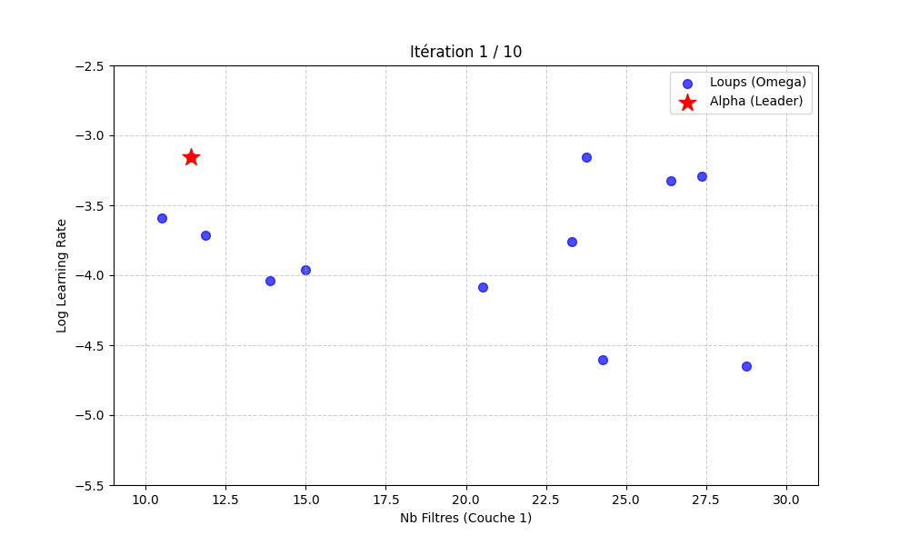

# CNN-Optimization-GreyWolf
Optimisation automatisée (AutoML) des hyperparamètres d'un CNN pour MNIST en utilisant l'algorithme Grey Wolf Optimizer (GWO).

# AutoML : Grey Wolf Optimizer pour CNN
Ce projet présente une méthodologie d'optimisation des hyperparamètres de réseaux de neurones convolutifs (CNN) basée sur l'algorithme bio-inspiré Grey Wolf Optimizer (GWO).

# Synthèse des performances
L'étude compare trois approches d'optimisation sur le jeu de données MNIST:

| Algorithme | Temps d'exécution | Précision (Test) |

| **Differential Evolution (DE)** | 2687s | 99.01% |
| **GWO (avec itérations)** | 1320s | 99.08% |
| **GWO (avec seuil)** | **1421s** | **99.23%** |

NB : Les tests ont été réalisés avec une population de 12 loups sur 10 itérations principales.

# Concepts Mathématiques
L'algorithme imite la hiérarchie sociale des loups (Alpha, Bêta, Delta) pour encercler la proie (l'optimum global). La position des loups est mise à jour selon :
X(t+1) = X_p(t) - A*D
La fonction de fitness utilisée pour évaluer chaque architecture est définie par :
Fitness = (1 - Accuracy_val) + lambda * (Params/Params_max)

# Points forts du projet
- Mon programme a réussi à créer une IA 66% moins lourde qu'une version classique. Elle utilise donc beaucoup moins de mémoire et de puissance pour fonctionner.
- Grâce à l'algorithme des loups (GWO), l'IA trouve les bons réglages très rapidement dès le début des tests. On ne perd pas de temps à chercher dans le vide.
- Le système choisit tout seul les meilleurs paramètres mathématiques (nombre de filtres, réglages d'apprentissage, etc.). Plus besoin de faire les réglages à la main.

